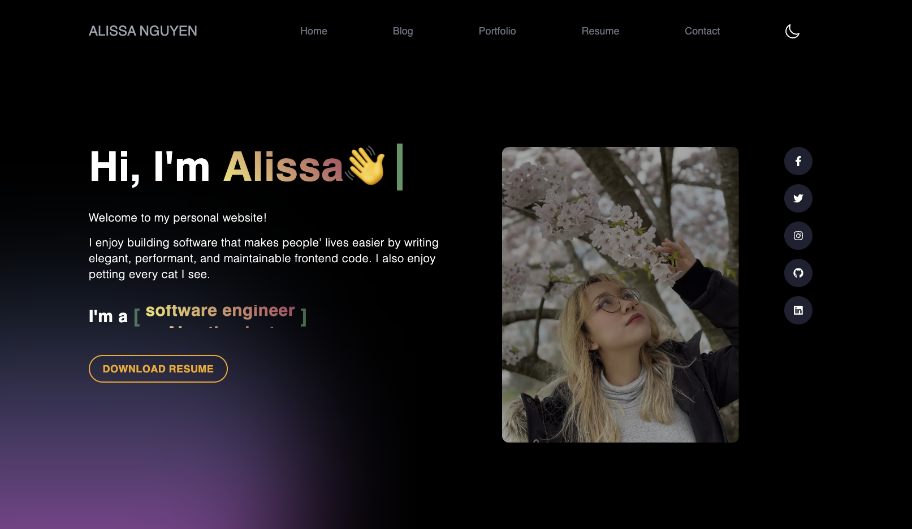
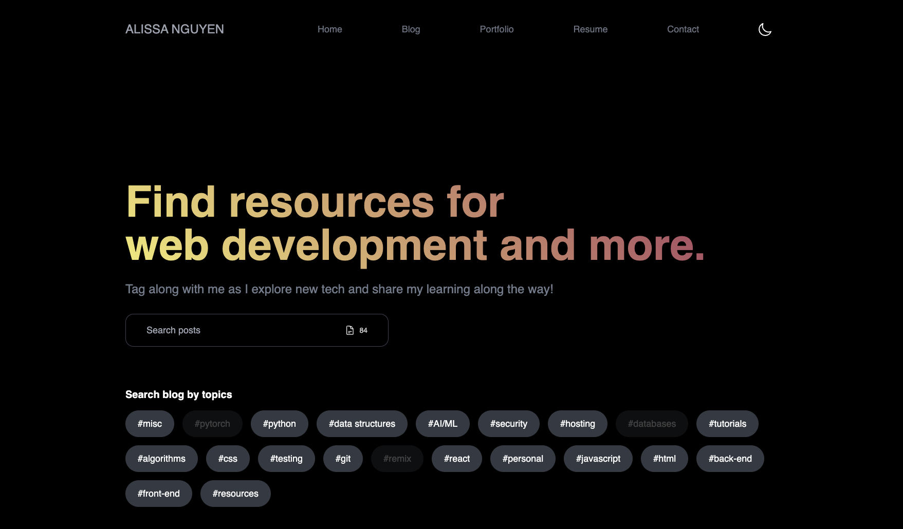

# Alissa Nguyen's Website

URL https://www.alissanguyen.com

This is my personal portfolio website and also is where I publish my writings.

## Technologies

### Front-End
- Mainly built with NextJS App Router, React, and TailwindCSS
- React Intersection Observer for animation when in frame
- useTypewriter Hook - NPM Package published by me.

### Deployment
- Deployment through Vercel

### Domain Management
- Cloudflare
- Namecheap

### Content Management System (CMS)
- Contentful

### UI & Animation Libraries
- ReachUI
- AnimeJS
- Framer Motion

### Others
- EmailJS - for automatic email
- Error Stack Parser - for tracking error in development
- Prism React Renderer - for code snippets
- Hero Icons and React Icons - for svg/png icons

